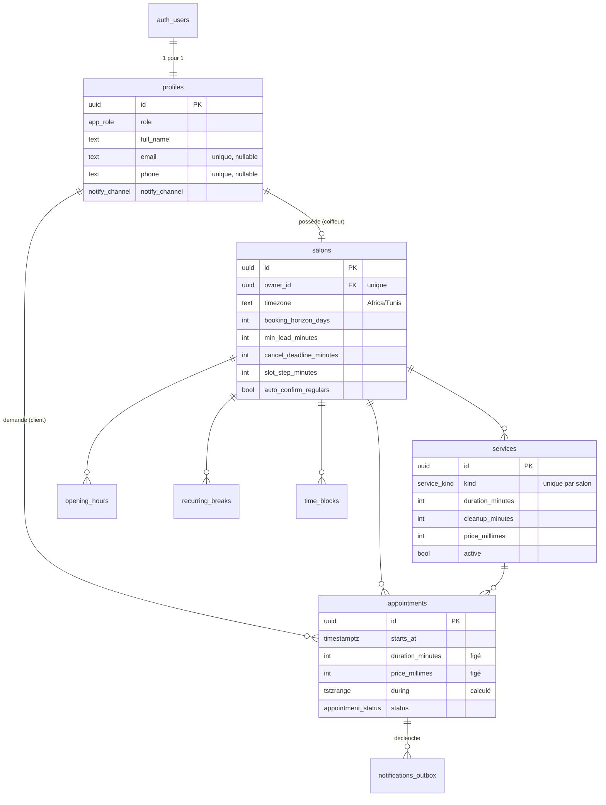

# Modèle de données



## Les décisions qui structurent tout

### L'argent est un entier de millimes

`price_millimes integer`, jamais `numeric` ni `float`. Le dinar tunisien se divise en
1000 millimes ; 20 DT s'écrit `20000`. Aucune addition de prix ne peut dériver.
Le formatage pour l'affichage est la responsabilité de `packages/core/src/money.ts`.

### Les instantanés de prix et de durée

`appointments.price_millimes` et `appointments.duration_minutes` sont **copiés** depuis
la prestation au moment de la demande, pas lus par jointure.

Si le coiffeur augmente son tarif demain, le rendez-vous déjà pris garde le prix
annoncé au client. C'est la règle honnête, et c'est aussi la seule qui rende
l'historique lisible : un rendez-vous de juin doit afficher le prix de juin.

### La plage d'occupation `during`

`during` couvre `starts_at` → `starts_at + duration + cleanup`, borne droite exclue
(`[)`). C'est l'occupation réelle de l'agenda. L'heure de fin **affichée au client**,
elle, est `starts_at + duration` : la marge de remise en état ne le concerne pas.

Cette colonne est recalculée par le trigger `appointments_set_during` à chaque écriture.
Une colonne générée aurait été plus élégante, mais PostgreSQL refuse : `timestamptz +
interval` n'est pas `immutable`, puisque le résultat peut dépendre du fuseau.

### La contrainte d'exclusion

```sql
exclude using gist (salon_id with =, during with &&) where (status = 'confirmed')
```

Le cœur du produit. Elle porte **uniquement** sur les rendez-vous confirmés : les
demandes en attente ont le droit de se chevaucher, c'est justement le conflit que le
coiffeur arbitre. L'extension `btree_gist` est requise pour mélanger une égalité
(`salon_id`) et un recouvrement (`during`) dans le même index.

### Les fuseaux horaires

- Tous les instants sont des `timestamptz` — stockés en UTC, sans ambiguïté.
- Les horaires d'ouverture et les pauses sont des `time` **locaux**, sans date.
- La conversion se fait au seul endroit prévu pour ça : la fonction `local_ts(day, time, tz)`.

Un client en déplacement à Paris voit « jeudi 11:00 » comme le voit son coiffeur à
La Marsa. Le fuseau du téléphone n'entre jamais dans un calcul.

### La file de notifications

`notifications_outbox` découple l'événement métier de son envoi. Le trigger
`on_appointment_change` dépose une ligne ; un worker la relève, l'envoie, l'horodate.

Trois bénéfices : une panne du fournisseur d'emails ne fait pas échouer une
réservation ; on peut rejouer un envoi ; et on a une trace de ce qui est parti,
à qui, sur quel canal.

Le rappel J-1 est inséré à l'avance avec un `send_after` dans le futur, et **supprimé**
si le rendez-vous est annulé ou refusé.

## Les fonctions qui font autorité

| Fonction | Appelée par | Ce qu'elle garantit |
|---|---|---|
| `available_slots(service, jour)` | client, back-office | La grille réelle, horaires + pauses + blocages + rendez-vous confirmés + délai minimum |
| `request_appointment(service, début, note)` | client | Revalide le créneau côté serveur, fige prix et durée, refuse le double-booking du même client |
| `decide_appointment(rdv, accepter, motif)` | coiffeur | Confirme ou refuse, refuse automatiquement les demandes concurrentes |
| `cancel_appointment(rdv, motif)` | les deux | Applique le délai au client, jamais au coiffeur |

Toutes sont `security definer` : elles s'exécutent avec les droits de leur
propriétaire, contournent RLS pour faire leur travail, et vérifient elles-mêmes qui
appelle via `auth.uid()`.

## Row Level Security

| Table | Lecture | Écriture |
|---|---|---|
| `profiles` | soi-même ; le coiffeur voit les clients qui ont un rendez-vous chez lui | soi-même |
| `salons`, `services`, `opening_hours`, `recurring_breaks`, `time_blocks` | tout le monde (la vitrine est publique) | le propriétaire du salon |
| `appointments` | le client concerné, ou le coiffeur du salon | **aucune** — tout passe par les fonctions |
| `notifications_outbox` | le destinataire | **aucune** — réservé au worker |

L'absence de politique d'écriture sur `appointments` n'est pas un oubli : c'est le
mécanisme. Sans politique, aucune écriture directe n'est possible, et les fonctions
restent le seul chemin.
